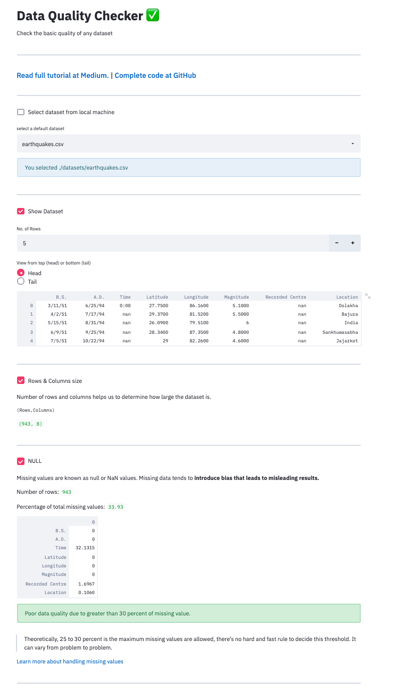

# Data Quality Checker in Python

Check the basic quality of any dataset.

## Sneak Peek


## [Read full tutorial at Medium.](https://medium.com/@maladeep.upadhaya)

## Requirements

* python 3.7 version
* streamlit 0.60 version 
* pandas
* numpy
* matplotlib


## Usage Description for Local Run

+ Install streamlit and other dependencies as mentioned in **Requirements**
+ Clone the repository: ```git clone https://github.com/maladeep/palmerpenguins-streamlit-eda.git```
+ Run as ```streamlit run app.py```

 OR
 
 > Simply run the web app https://explore-palmer-penguins.herokuapp.com


  **Any feedbacks and suggestions are highly appreacited.**
